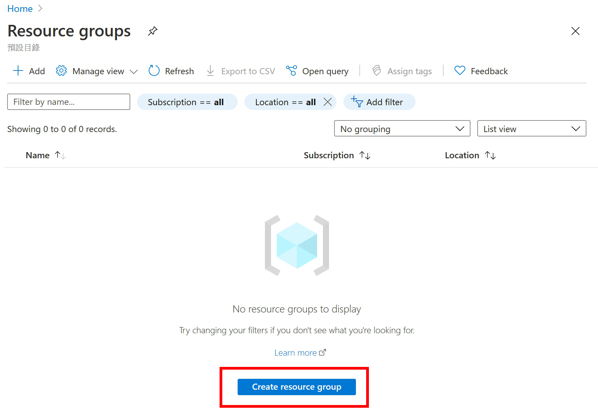
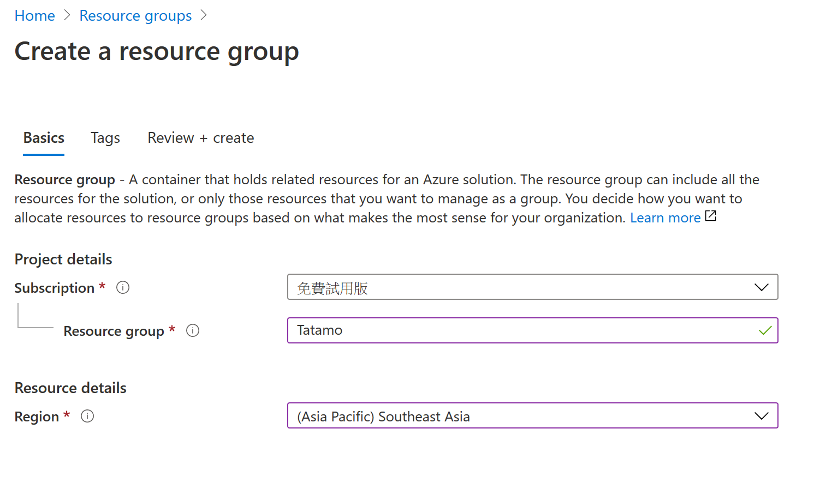
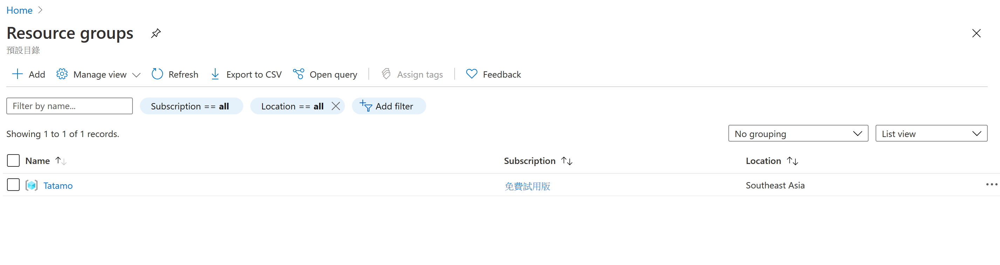
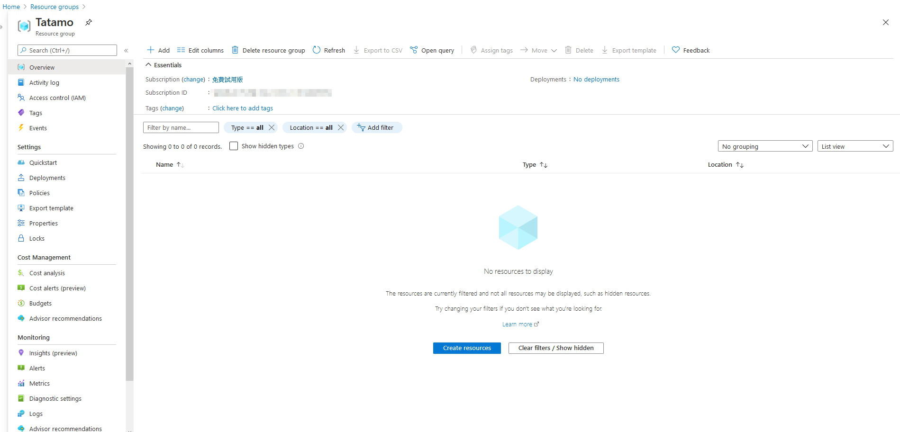

Resource group 提供管理Azure資源的服務，你可以讓所有同樣專案的服務放在同一個resource group 中，這樣除了較容易檢視管理以外，在之後自動化設定或是部屬資源時，比較不會因為名稱錯誤而找不到對應的資源去進行。

今天這一篇主要簡單說明如何建立resource group，以便後續建立新的資源或服務的時候可以選擇。

# 建立resource group

進入 resource group 列表後，按一下 create resource group ，網頁便跳轉到建立的頁面。

選擇 訂用帳戶(subscription)、定義名稱(Resource group)、並選擇資源所在位置(Region)。然後直接按`Review + create`，然後再按`create`就完成囉!!

接著就可以在 resource group 列表中看到剛剛建立的 `Tatamo`，接下來要建立新的服務或資源，就可以選擇`Tatamo`囉!

進入Tatamo後的畫面如下，畫面下方的地方顯示在這個 resource group 中的資源或服務，因為現在還沒有，就會是空的。

